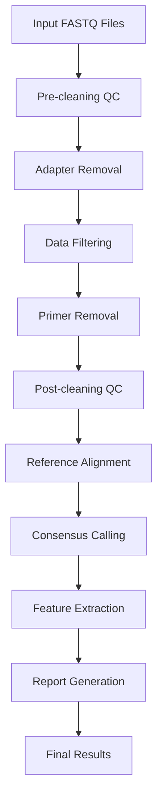
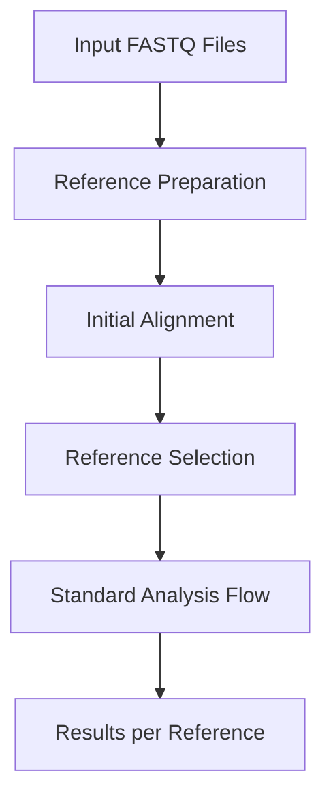

# ViroConstrictor Architecture

ViroConstrictor is a Snakemake-based bioinformatics pipeline designed for viral genome consensus sequence generation from NGS data. The architecture follows a modular design with distinct workflows for different analysis scenarios.

## Overview

ViroConstrictor consists of two main workflows:
1. **Main Workflow**: Standard viral genome analysis pipeline
2. **Match-Reference Workflow**: Multi-reference selection and analysis

The pipeline is built using Snakemake, providing scalability, reproducibility, and flexible execution across different computing environments.

---

## Architecture Components

### Core Structure

```
ViroConstrictor/
├── workflow/
│   ├── main/                    # Primary analysis workflow
│   │   ├── workflow.smk         # Main workflow entry point
│   │   └── components/          # Modular rule components
│   ├── match_ref/               # Reference selection workflow
│   │   ├── workflow.smk         # Match-ref workflow entry point
│   │   └── components/          # Match-ref specific components
│   ├── helpers/                 # Shared utility functions
│   └── envs/                    # Conda environment definitions
├── scheduler.py                 # Grid system auto-detection
├── workflow_executor.py         # Execution orchestration
└── ...
```

### Workflow Components

The main workflow is organized into logical processing stages:

#### 1. Preparation Stage
- **Reference Processing** (`preparation.references.smk`)
- **Primer Processing** (`preparation.primers.smk`) 
- **Feature Processing** (`preparation.features.smk`)

#### 2. Quality Control & Cleaning
- **Pre-cleaning Stats** (`stats.pre_clean.smk`)
- **Adapter Removal** (`clean.adapter_removal.smk`)
- **Data Filtering** (`clean.data_filter.smk`)
- **Primer Removal** (`clean.primer_removal.smk`)
- **Post-cleaning Stats** (`stats.post_clean.smk`)

#### 3. Results Generation
- **Sequence Generation** (`results.sequences.smk`)
- **Reporting Metrics** (`results.reporting_metrics.smk`)
- **Data Concatenation** (`results.concatenations.smk`)

---

## Workflow Execution Flow

### Standard Analysis Flow



### Match-Reference Flow


